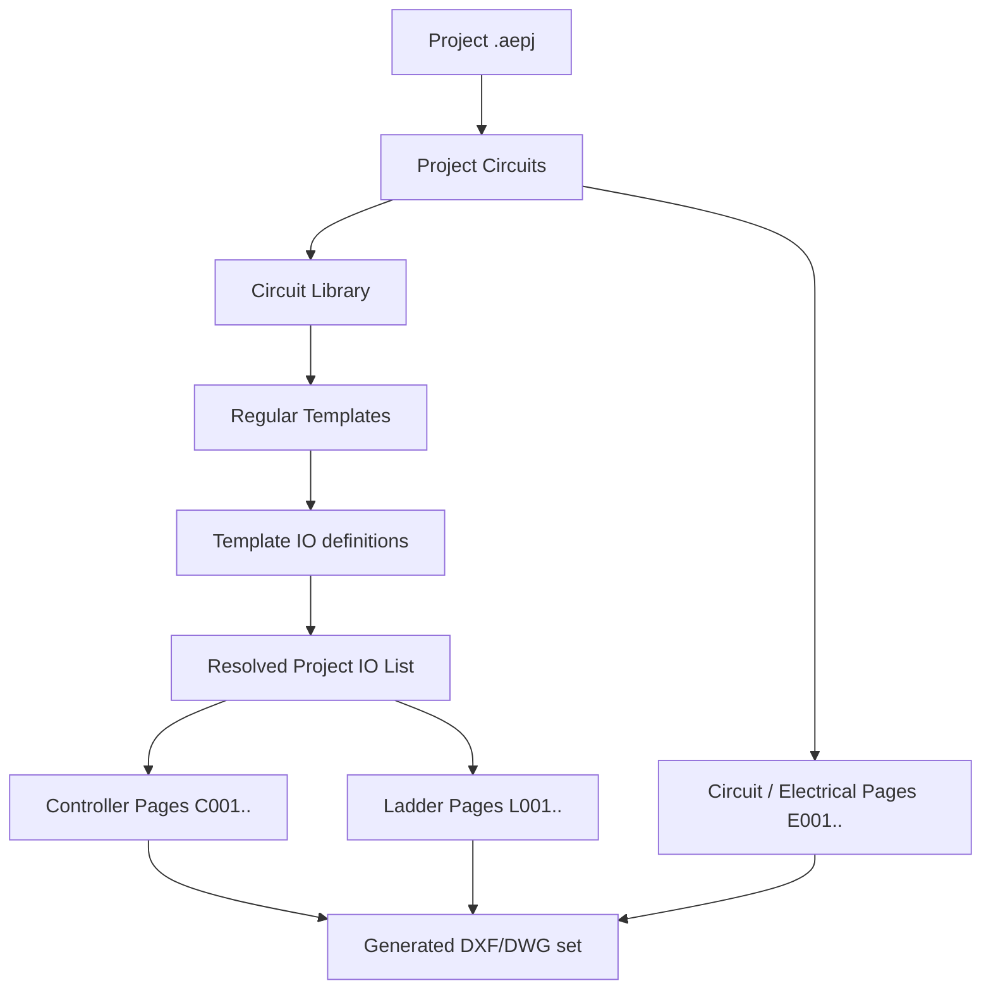

# QuantumB — Application Plan (Original Requirements vs. Current Implementation)

This document captures the original product requirements for the AutoCAD
Electrical drawing generator (HVAC unit control drawings) and maps each
requirement to its current implementation status in this codebase. It is a
living reference — update the "Status" column/notes as features evolve.

## 1. Core concept

Generate AutoCAD Electrical (DXF/DWG) drawing sets for an HVAC unit from
reusable **templates**, organized by **circuits**, driven by an **IO** list,
plus **controller** pages and **ladder diagram** pages for control logic.

## 2. Requirement-by-requirement status

### 2.1 Templates → Circuits → IO
> "a circuit is composed of templates, these templates will have IO, we need
> to link the io to block fields in the template"

- **Status: Implemented.**
- `Circuit` (`src/core/models.py`) holds a list of `Template` refs plus
  `circuit_ios` (circuit-level IO not tied to a template).
- Each template (regular/controller/io/ladder/valves) has its own IO list
  stored via `TemplateManager.set_template_ios` / `get_template_ios`
  (`src/core/template_manager.py`), edited through the **Template I/O**
  table in [main_window.py](../src/gui/main_window.py) (`_tmpl_ios`,
  `TemplateIODialog` in [dialogs.py](../src/gui/dialogs.py)).
- IO ↔ block-field linking is done by DXF **ATTRIB** substitution:
  `DrawingGenerator.replace_value_dwg()` matches an IO's `old_name`
  (placeholder text baked into the template's attribute) and writes the
  resolved value — this is how a block field on the template becomes bound
  to a specific IO.

### 2.2 Linking a block field to the next/previous page
> "we also need to be able to link a block field to the next or previous
> page (electrical lines that will follow)"

- **Status: Not yet implemented.** No `next_page`/`previous_page` reference
  concept exists in `models.py`, `template_manager.py`, or the drawing
  generator today. This is an open item — see §3.

### 2.3 Incrementing values (e.g. `fan_status#1`, `#2`, …)
> "we need to also be able to increment value (if we have a fan in a circuit
> and we add another one ... we want fan_status# 1,2,3 etc)"

- **Status: Implemented** via the `#` placeholder convention.
- Circuit/template IO names/descriptions containing `#` are replaced with
  the circuit's resolved number (`_resolve_project_circuit_numbers()` in
  main_window.py handles circuits whose `circuit_number == "#"` by
  auto-incrementing 1, 2, 3…).
- Duplicate-name collisions after substitution are handled by dedup logic
  (see repo memory `io-deduplication.md`): trailing `-A/-B/-C` letter
  suffixes, or digit-increment by a fixed step for numeric tags.

### 2.4 Controller configuration (name, IO count/position/type)
> "for the controller we need to be able to set their information name
> number of io position of those io type (input or output) when we generate
> we need to be able to add io templates to the controller to be linked to
> their IOs"

- **Status: Implemented.**
- Modules library (`config/modules_library.json`, managed by
  `src/core/module_manager.py`) defines named controller "modules" with
  `inputs`/`outputs` (each `{name, x, y}` slot position) and an assigned
  controller **template**.
- At generation time (`MainWindow._generate` → controller-pages section),
  IO items are paged across controller pages (`C001`, `C002`, …) sized to
  `mod_inputs`/`mod_outputs` capacity, and an **IO template** is placed at
  each slot's `(x, y)` position (offset by the IO template's own insertion
  point), attribute-substituted via `_enrich_io_item()`.
- IO → IO-template resolution: `_get_io_template_name()` /
  `_resolve_io_type_def()` in `src/cli/cli.py`, driven by the IO Type's
  `io_template` field (`config/io_types_library.json`).

### 2.5 Shared common logic for inputs
> "we also have a logic for the input, some of them have a shared common"

- **Status: Implemented.**
- Module schema has `input_commons` / `output_commons` (common terminal
  positions) and `input_common_shared` (bool). When set, `_get_io_template_name`
  is called with `input_common_shared=True` and a running
  `shared_input_index`, so consecutive shared-common inputs resolve to a
  shared-style IO template instead of one-per-slot.
- IO Type entries can also be marked `shared` with a `shared_template`
  (`IOTypeDialog`, `config/io_types_library.json`).

### 2.6 Block ref → template (IO origin) linking
> "we need to be able to link block ref to the templates where the io comes
> from"

- **Status: Implemented implicitly.** Every `IOItem` carries `template_name`
  and `circuit_name`/`circuit_no` (set in `_refresh_io_table()`), so the IO
  table and exports always show which template/circuit a given IO field
  originated from. There isn't yet a reverse lookup UI ("show all block refs
  fed by this template"), but the data linkage exists.

### 2.7 Ladder components (24VDC / 24VAC) and per-type templates
> "for ladders certain io will have need for ladder components, we will have
> 2 types 24vdc and 24vac, we need to be able to set a template for each"

- **Status: Implemented (generalized beyond exactly 2 types).**
- `IOType` entries (`config/io_types_library.json`) have `ladder_type` (a
  free-form label, e.g. `24VDC`/`24VAC`) and `ladder_component_template`
  (the DXF component template to stamp per IO of that type) — see
  `IOTypeDialog` and `TemplateIODialog` (`ladder_type`, `ladder_template`,
  `ladder_component_template` columns, `_TMPL_IO_COLS`).
  Ladder component templates live under
  `templates/ladder_components/` (`LADDER_COMPONENT_TEMPLATES_DIR`), with
  per-template configurable **offset** (x, y) via
  `TemplateManager.get_offset`/`set_offset`.

### 2.8 Ladder generation with automatic paging
> "then we will need to generate the ladder which means adding ladder
> components to the ladder and if we need more space we create a new one"

- **Status: Implemented.**
- `MainWindow._generate_ladder_pages()`:
  1. Groups IO items by `ladder_type` (via `_ladder_comp_dict` /
     `_ladder_type_ladder_map`).
  2. For each ladder type, loads the matching **ladder template**
     (`templates/ladder/`) and computes `components_per_page` from the
     template's usable vertical span (busbar bounds) and a fixed
     `_COMPONENT_Y_STEP`.
  3. Chunks the IO list into pages of that size, generating `L001`, `L002`,
     … pages, placing each ladder-component template at a computed slot and
     substituting attributes (`_prepare_ladder_component_doc`: `COTAG`,
     `CONTL-IO`, `NAME`, `NUM`, `CIRCUIT#`, `PS#`, `SOL#`, `SD#`, etc.).

## 3. Known gaps / open items

| # | Gap | Notes |
|---|-----|-------|
| 1 | Next/previous page block-field linking | Needs a "wire continuation" marker concept: a block field referencing the drawing/page where the signal continues. No data model or generator support yet. |
| 2 | Reverse "block ref → template" browser UI | Data exists on `IOItem` (`template_name`, `circuit_name`); no dedicated UI view to browse by block ref. |
| 3 | `web_interface/legacy` vs `current` | Per `WEB_CIRCUIT_COMPRESSOR_PLAN.md`, web server currently serves `current`; circuit/compressor configurator UI is still catching up to desktop feature parity (ladder/controller paging not exposed in web flow yet). |
| 4 | CLI regular-template loading for compressor templates | `CLIGenerator` only loads circuit-page templates from the ladder templates dir in some paths — regular-type compressor templates can silently render blank pages (see `project-structure.md` memory). |

## 4. Where things live (quick reference)

| Concern | Module |
|---|---|
| Data models (Circuit, Valve, Template, ValveIO) | `src/core/models.py` |
| Circuit library persistence | `src/core/circuit_library.py` |
| Template storage/insertion points/offsets | `src/core/template_manager.py` |
| Controller module definitions | `src/core/module_manager.py` |
| IO Types (ladder_type, io_template, shared) | `config/io_types_library.json` + `IOTypeDialog` |
| Drawing generation (attribute substitution, placement) | `src/core/drawing_generator.py` |
| GUI orchestration of generation (`_generate`, ladder/controller paging) | `src/gui/main_window.py` |
| CLI generation | `src/cli/cli.py` |
| Web API + circuit/compressor configurator | `src/web/web_server.py`, `web_interface/current/` |
